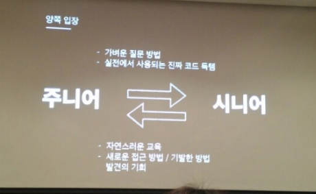
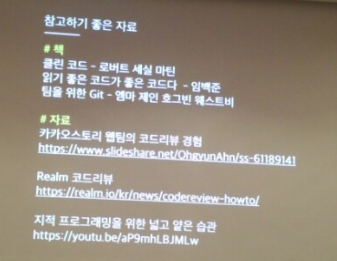
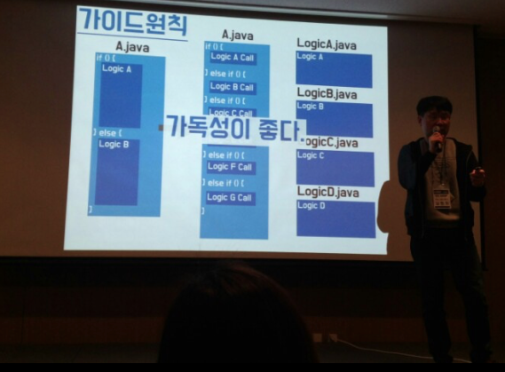
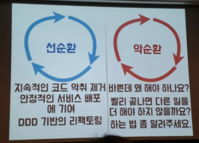
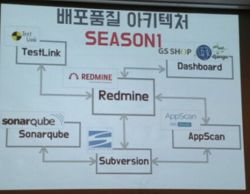
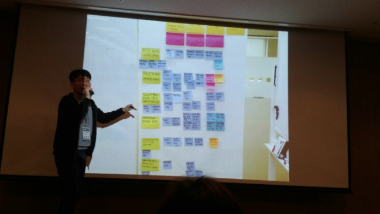
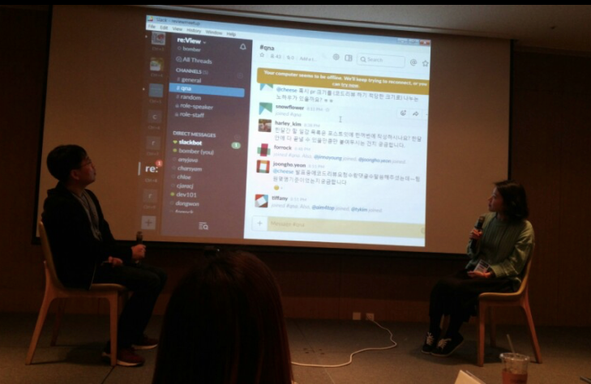

# reView 1st 참석후기

 

[신상재님](https://www.facebook.com/sangjae.shin?fref=ts)이 주도하신 첫번째 review meetup에 참가하였습니다!  
(공부한 내용을 정리하는 [Github](https://github.com/jojoldu/blog-code)와 세미나+책 후기를 정리하는 [Github](https://github.com/jojoldu/review), 이 모든 내용을 담고 있는 [블로그](http://jojoldu.tistory.com/)가 있습니다. ) 
세미나의 자세한 내용은 [워드프레스](https://reviewmeetup.wordpress.com/2017/03/11/review-1st-impact-20170322/)를 참고하시면 될것 같습니다.  
  
이번 행사는 전체적으로 **좋은 품질의 코드를 작성하기 위한 노력**에 포커스가 맞춰진것 같았습니다.  
특히 20명이상의 학생분들이 오셔서 생각지 못한 기운을 얻을 수 있었던것 같습니다.  

여담으로 여태 참여했던 행사중에서 가장 많은 후원이 있었던것 같습니다.  
[지앤선](http://jiandson.co.kr/), [위키북스](http://wikibook.co.kr/), [제이펍](http://www.jpub.kr/)에서 책 후원을 해주셨는데, 이렇게 좋은 행사가 계속 이어질 수 있도록 IT 도서 구매하시는 분들은 위 3 출판사에서 구매해주시면 더 좋겠죠?  
  
발표자료는 곧 올려주신다고 하셨습니다.  
금방 페이스북에 올라와서 많은 공유가 이루어질것 같으니, 조금만 참으시면 될것 같습니다. 
그럼 이제 발표 내용 시작하겠습니다!  

### 코드리뷰를 시작하려는 그대에게 - 서지연

(나프다 MC로, 카카오의 웹 개발자로 일하시는 서지연님, 일명 치즈님)  

* 지난 나프다에선 **코드리뷰 습관**에 대한 이야기를 했지만, 이번엔 코드리뷰를 시작하는 분들을 위한 이야기
* 오늘의 이야기
  * 시작단계에서 내가 배웠던 것
  * 시작단계에서 내가 좋았던 것
  * 응원
* 대상
  * 코드리뷰를 시작하려는 사람
  * 코드리뷰를 시작하려는데 막막한 사람
  * 시작했는데 잘 안되는 사람

* 코드리뷰가 필요없는 경우
  * 혼자 코딩하며 이코드는 누구와도 절대 공유안할 경우
  * 내코드는 완벽해서 절대 빈틈이 없는 경우
  * 장애가 절대 나지 않는 경우
* 코드리뷰가 필요한 경우
  * 앞 경우 빼고 다!

#### 부끄러워 / 내가 어찌 감히!
* 주니어의 오해
  * 내 코드가 이상할것 같아
  * 내 실력이 부족한데 무슨 리뷰 코멘트를 달지
  * 내가 낄 틈이 없네
  * 혹시 예의가 없다고 생각하면 어쩌지
* 시니어의 오해
  * 내 코드 짜기에도 바쁨
  * 경력은 많은데 내 코드 별로라고 생각하면 어쩌지
  * 잔소리라고 생각하면?
  * 지금 나를 지적하는건가?

* 양쪽입장

* 코드리뷰는 잔소리가 아닌 **코드로 하는 커뮤니케이션**
* 부끄러움은 짧고 내 코드의 **히스토리**는 길다
* 덮어놓고 (코드)낳다보면 **거지꼴(장애)** 못 면한다.

#### 상처주지도 / 상처받지도
* 코드리뷰는 내가 아는 것을 **잘난척** 하는 것이 아님
* 온라인 코드리뷰는 표정,억양,상황,기분을 알 수 없음
* 최대한 **친절하게! 격려하며!** 최대한 **구체적으로! 자세하게!**
* **커뮤니케이션** 능력이 이제는 개발자의 역량
* 잘 설명하려고 노력하다보면 리뷰어가 더 **이해를!**
* 왜 이렇게 짰어요?
  * 의도한 바가 아니더라도 상처를 받을 수 있음
  * 의외로 진짜 궁금해서 물어 본 경우일 수 있음
* 코드 != 나
  * 나에 대한 평가가 아니라 그저 코드에 대한 리뷰

#### 할 수 있는 만큼씩만 하자
* 사람 수 만큼이나 엄청나게 밀려들어온 리뷰 요청
* 내 요청건에 엄청나게 달려있는 리뷰 코멘트
* 모든 리뷰에 피드백을 달아야 한다는 **강박**은 버리자
  * 지속가능한 문화를 만드는 것이 더 중요

#### 나의 의견을 고수하자
* 협업에서 어느정도 **가이드라인**(코드포멧팅, 네이밍규칙 등)은 필요
* 하지만 개발자에게 **취향**이란!
  * A라는 문제를 두고 1로 풀지 2로 풀지는 개발자의 장점
  * 취향이란 것은 개발자에게 자존심에 가깝다
  * 즉, 자신의 의견이 있다면 리뷰의 **반대** 의견도
  * 그 코드를 짜고, 고민을 한 사람은 **자신**

#### 도입 초반이 중요
* 개발리더가 아닌, 솔선수범할 **코드리뷰 리더**가 필요
  * 팀원들에게 코드리뷰를 상기
  * 꼭 시니어 혹은 기술력이 뛰어난 사람이 해야하는 일이 아님
* 좋은 코드에는 그만큼의 액션을 취해주자
* 내가 짠 코드를 좀더 봐줬으면 하는 사람에겐 **멘션 지정**
* 필요하다면 정기 **오프라인 미팅**
  * 온라인 리뷰만 하면 제대로 되고 있는지 확인이 잘 안됨
* 코드리뷰리더도 사람이기에 아낌없는 격려와 칭찬, 고마움 표현!

#### 공감 (MSG 좀 있음!)
* 첫번째 코드리뷰 도입 시도
  * 이번주에 코드리뷰 제일 많이 한 사람에게 포상
  * 처음에는 열심, 코드 퀄리티도 올라가고 리뷰도 증가
  * 하지만 그 돈으로 결국 다같이 햄버거 사먹음
* 두번째 코드리뷰 도입 시도
  * 새로운 피쳐마다 꼭 다같이 코드리뷰를 하자
  * 코드리뷰 전까진 그 코드는 절대 배포 못함!
  * But, 당장 오픈일이 다가오고, 테스트에서도, QA에서도 문제없는데 코드리뷰 해야하나?
* 세번째 코드리뷰 도입 시도
  * 코드리뷰 장인이 등장!
  * 당시 상태
    * 코드리뷰는 하지만 큰 피쳐 들어갈때만
    * 한꺼번에 하는 양이 많음
    * 오프라인으로 자주 진행
    * 하는 사람만 함
  * 장인왈 : "코드리뷰하면 좋아요 제가 전에 느꼈던 점을 공유할게요"
  * 위 내용이 전부 장인이 공유해준 경험
  * 한달간 100개의 리뷰, 120개의 댓글, 하루 20개의 리뷰요청과 댓글이 달릴정도로 활성화
* 물질적 보상, 억지로 하는 규칙은 오래가기 어렵다
* 직접 그 효과를 경험할때 자발적 참여가 됨

#### 이외 장/단점
* 신규 개발자에게 **베이스 코드**를 알려주고 더 안전하게 **안착**하는데 도움
* 오늘의 리뷰어가 내일의 든든한 **보험**
  * 휴가를 가더라도 리뷰를 해준 사람이 회사에 있기에 안심하고 갈 수 있음 
* 정량화 하기 힘든 코딩실력, 하지만 자연스레 드러나는 **참여열정**과 **숨은 내공**
* 코드리뷰 부분 아닌데 연결된 다른 곳에서 문제 발견

#### 진행하면서 바뀐 점
* 자연스러운 자기 코드 퇴고
  * 남이 본다는 생각에 다시 한번 나의 코드를 보게 됨
* 적절한 도구 사용은 필수
  * 깃헙
  * 슬랙 등등

* 정담은 없다!
  * 우리 팀만의, 회사만의 문화를 만들어가자.

* 참고!

### 코드품질 개선을 위한 GS SHOP 고군분투기 - 김헌기

* 서문래 프로젝트라는 미트업 행사도 있으니 다음엔 같이 했으면 좋겠다.
* 오늘은 어벤져스의 이야기는 아님
* **대규모 서비스에서 코드품질을 유지**하는 방법에 대해 이야기할 예정

#### 우리의 고민
* 예전에는 엔터프라이즈 즉, 항공모함 같은 조직이라 암초가 보일 경우 그쪽은 쳐다보지도 않았음
  * 그러나 이제 세상이 너무 복잡하고 변수가 많아졌음
  * 스타트업과 같은 민첩함이 필요하다고 해서 **애자일**을 도입하게 됨
* 예전에는 소수의 관리자가 개발을 하지 않고 관리만 잘해도 인정받았음
  * 고객의 요구에 맞춰 빠르게 개발/배포를 해야하는 상황이 옴
  * 관리자도 코드로 이야기 해야되는 변화에 직면하게 됨
* 10년째 이어온 레거시코드들이 존재함
  * Java파일 하나에 44,469 라인도 있음 => A4 670장
  * 하나의 메소드에 인수가 20개 이상 있는 것도 있음
* 이것은 해결해야 할 **기술부채**
  * 원인은 무엇일까?
* 가이드 원칙

* 잘되는 회사 vs 잘 안되는 회사

#### 우리회사에서 시도하기 시작한 것
* 매일/안정적인/제품 출시를 위해
  * 측정가능한/투명한/품질활동을 보여주자는 목표 설정
* 첫 걸음
  * 관리자와 테스트 전문가를 주축으로 개발언어와 프레임워크를 학습
  * 대시보드를 개발하여 배포품질 프로세스를 확인
  * But!, 40대 관리자가 10년 경력 개발자 따라잡기는 힘들다
    * 파이썬 & 장고를 선택
  * 배포품질 활동 타운 건설
    * 리더/엔지니어/테스트전문가/보안전문가들로 입주민 구성
    * 수평적인 문화를 위해 닉네임으로 변경

(사용된 품질개선을 위한 도구들)  

* 배포품질 프로세스 세션1
  * 개발 -> 배포검증요청 -> 코드점검 -> 테스트 -> 점검완료 -> 배포

* 위처럼 해도 바로 개선되지는 않았음
  * 코드리뷰 운동을 시작
  * 피자한판 함께 먹을 수 있는 인력으로 사내커뮤니티 활동 시작

* 소스다이어트 래프팅
  * 유지보수 가능한 코딩 기술을 전수하자
  * 코딩 리팩토링 가이드

#### 애자일
* 몇년전부터 애자일을 시도했지만 **불가능**하다고 생각하게 됨
  * 워터풀로 가야겠다는 생각을 하게 됨
* 매일 반복하는 품질 점검 운영업무는 그냥 하던일이나 잘하면 된다.
  * 하지만 이것은 끓어오르는 냄비속의 개구리가 되는 것

* 애자일은 아니더라도 커뮤니케이션 하는 방식을 바꿔보는게 어떨까 고민 및 실행
  * 운영 위주의 SM업무에서 **스프린트** 방식으로 변경
  * 한주의 스프린트 결과를 아주 작은 결과라도 모아서 보여주도록 그라운드룰을 정함
    * 실패라면 플랜B로 가면 되는데, 결과자체가 없으면 다음 방향을 잡을 수가 없음

* 관리만 할줄 아는 사람들이 남에게 의존적으로 하는 것이 아니라 이제는 **스스로 해보면서 가치를 찾고** 메세지를 전달할 수 있게 되었다. 

### Q & A

(슬랙에 올라온 질문에 대해 답변해주시는 김헌기님과 서지연님)  

* 카카오에는 코드리뷰 전담 조직이 있나요?
  * 서지연 : 조직마다 다름
* 카카오에는 전사적으로 Good Code를 선정하거나 공유하는 자리가 있나요?
  * 서지연 : 전사적으로 하는건 없으나 팀에서 가끔 발표를 하기도 함
* 코드리뷰 도입 이후 장애나 오류가 감소했다고 느꼈나요?
  * 서지연 : 평소에 덤벙대는 경우가 많아서 기초적인 실수는 많이 잡혔다.
  * 김헌기 : 프로세스 & 플랫폼 도입 후 장애가 줄어들었다고 평가를 받고 있음
* 코드리뷰 도구는?
  * 서지연 : 깃헙 엔터프라이즈 버전 사용중
  * 김헌기 : 서비스 운영 조직은 SVN, 우리팀은 깃랩 사용중
* PR을 코드리뷰 하기 적당한 크기로 나누는 노하우는?
  * 서지연 : Jira의 티켓이나 깃헙의 이슈를 생성해서 시작하는데, 내가 기억할 수 있는 만큼만 잘라서 시작함
  * 김헌기 : 아직 잘한다는 사례는 못봄
* 한달간 할 일감 목록은 포스트잇에 한꺼번에 작성하는지? 한달안에 다 끝낼수 있을만큼만 붙여주시는지?
  * 김헌기 : 매주 금요일에 주 단위로 붙인다. 한달안에 끝나는 범위는 확실히 정해서 한다.
* 코드리뷰 결과가 팀원 몇명 기준인지?
  * 서지연 : 13~14명정도 된다. 팀내에서 유닛을 나눠서 한 유닛에 3~4명씩 나눠서 유닛들간에는 긴밀한 관계로 진행한다. 코드리뷰 등
* 오프라인에서 코드리뷰 경험이 있는데 흐지부지된 경험이 있다. 온라인 코드리뷰에서 그런일이 없는지? 있으면 어떻게 극복하시는지?
  * 서지연 : 온라인이라 되는건 아니라고 생각한다. 의지의 문제라고 생각. 발표에서 나온것처럼 코드리뷰 장인의 리드가 있었고, 그로 인해 구성원들이 본인에게 도움이 되었다는 걸 느끼기 시작하니 활성화 됨
  * 서지연 : 규모가 중요한것 같다. 작은 내용이라도 온라인 리뷰를 지속적으로 하다보니 오프라인에서 코드리뷰가 부담이 줄어들었다.
  * 김헌기 : 코드리뷰 보다는 코드점검을 하고 있다. 
* 처음 별명 부르기 시작했을 때 거부감은 없었는지?
  * 김헌기 : 처음에 정말 어색했는데, 적응 되더라
* 리뷰를 도와주시는 장인님의 역할은 무엇인지?
  * 서지연 : 리뷰만 전담하진 않는다. 같은 개발자다. 문화가 정착되기 전까지 희생이 필요한데 그걸 해주셨다.
* 코드리뷰 단위로 PR을 보낼때, 문제해결코드와 리팩토링 코드는 분리하는게 좋은지?
  * 서지연 : 리팩토링은 별도로 PR을 보낸다. 한번에 보내는게 좋은데, 내가 처음에 받고자 했던 코드리뷰의 목적과는 좀 다르기 때문이다.
* 관리자들이 왜 개발을 해야한다고 생각하는지?
  * 김헌기 : 시대 흐름이 그런것 같다. 데브옵스를 원하고 빠르게 개발/배포를 하려면 관리자가 개발을 모를수는 없을것 같다.

### 후기
이렇게 좋은 행사에 참여할 수 있게 도와주신 May님께 정말 감사의 말씀을 드립니다.  
(제가 꼭 답례를..!)  
이번이 1차였기 때문에 앞으로도 계속해서 행사가 진행될것 같습니다. 혹시나 이번에 참석하지 못하신 분들은 다음 행사에는 꼭 참석하시면 좋을것 같습니다.  
특히 좋은 코드를 고민하는 선배 개발자분들의 이야기는 이제 개발자를 시작하시는 주니어 혹은 취업준비생분들에게 큰 도움이 되지 않았을까 싶습니다.  
다음에도 같은 주제로 할지는 모르겠지만, 그래도 그때도 참석할 기회가 되면 또 참석해서 후기 남기도록 하겠습니다.  
긴 글 끝까지 읽어주셔서 감사합니다.