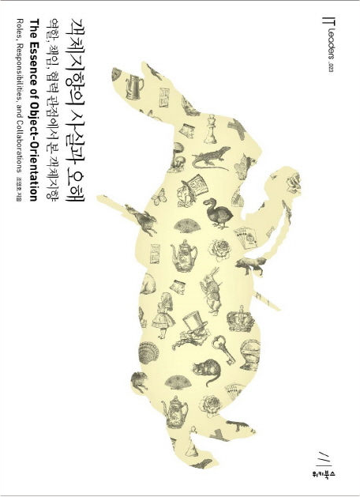

# 객체지향의 사실과 오해 - 조영호

TDD를 점점 시도하면서 Java라는 **객체지향 언어**에 대한 이해도가 높지 않음을 깨닫게 되어 이를 채우기 위해 시작

> 결국 이 책에서 하는 이야기는 객체지향 설계란 기존의 방식인 데이터를 기준으로 하는 것이 아닌, 해당 객체가 행하는 행동을 기준으로 설계해야 한다는 것이다. 
우린 그전까지 항상 Database의 Table을 기준으로 코드를 작성했기 때문에 **객체지향 언어를 사용한것 뿐**이지, 실제로 객체지향적으로 코딩을 한 것이 아니다. 
객체, 객체를 보자. 그리고 그 객체가 다른 객체들과 어떤 협력 관계를 맺고 있고, 어떤 행위를 하는지를 고려해서 설계를 하자.

## 1. 협력하는 객체들의 공동체
커피숍에서 커피를 먹는 목적을 달성하기 위해선 커피를 주문하고 마시는 손님과,  
주문을 받고 바리스타에게 전달하는 캐시어,  
커피를 제조하는 바리스타가 각자 **본인의 역할에 맞게 행동**을 하면서 달성할 수 있게 된다. 
즉, 객체지향이란 여러 객체들이 서로 **협력**하는것을 기본으로 한다.

#### 객체가 갖춰야할 덕목

* 협력
  - 모든 것을 스스로 처리하려고 하는 God 객체는 결국 내부 복잡도로 자멸한다. 객체는 다른 객체의 **요청에 응답**만 할뿐이다.

* 자율
  - 특별한 목적을 위해 (여기선 Request에 정상적인 응답을 주기 위하는 정도라고 보면 될것같다.) 각각의 객체가 본인의 역할을 수행해야 한다.

#### 객체를 지향하라.
객체지향의 중심은 클래스가 아니라 객체가 위치 한다.  
클래스들의 정적인 관계가 아니라 메세지를 주고 받는 객체들의 동적인 관계다  
> 즉, 어떤 클래스들을 선언했는지가 중요한게 아니라 어디에서 어떤 객체들이 주입되어 사용되는 지가 중요하다.

## 2. 이상한 나라의 객체
결국은 객체지향을 설계하고 개발한다는 것은 **현실을 모방하는 것이 아니라, 현실속 객체의 이름과 특징으로 새로운 세상을 만드는 것**이다.

#### 행동이 상태를 결정한다.
객체지향 설계는 상태(값)을 기준으로 설계하는 것이 아니라 행동(메소드)를 먼저 결정하고 설계해야만 한다.

## 3. 타입과 추상화
요즘의 지하철 노선도는 각 역의 실제 지형 정보를 표현하고 있지 않다.  
이는 지도가 가져야할 명확성을 버리고 그 목적인 **열차의 탑승/환승**에 집중한 결과이다.

#### 타입
객체의 타입에 대한 Tip

* 어떤 객체들이 **동일한 행동을 수행**한다면 그 객체들은 동일한 타입으로 분류 될 수 있다.
* 객체의 내부 코드는 외부로부터 철저하게 감춰져야 한다. 객체의 행동을 수행할 수 있다면 어떤 방식으로 표현해도 무방하다.
* 즉, 객체의 **내부 표현 방식이 다르더라도** 해당 객체들이 **동일한 행동**을 한다면, 그 객체들은 **동일한 타입**에 속한다.

> 예를 들면 "발송한다"라는 행위를 어떤 객체는 email을 발송할 수 있고, 어떤 객체는 sms을 발송할 수도 있다. 
둘은 내부에서 코드가 다를 수 있지만 결국은 전달 받은 메세지를 "발송한다" 라는 행위를 하고 있기 때문에 동일한 타입으로 볼 수 있다.

* 객체가 다른 객체와 **동일한 데이터**를 가지고 있어도 **다른 행동**을 한다면, 그 객체들은 **다른 객체**이다.

#### 타입의 목적
결국 타입은 추상화다. 타입은 시간에 따른 **객체의 상태 변경을 단순화**하는 방법이다.

* 클래스
  - 클래스와 타입은 동일한 것이 아니다.
  - 자바스크립트와 같은 프로토타입 기반의 언어에는 클래스가 존재하지 않는다.
  - 클래스는 타입을 구현하기 위해 프로그래밍언어에서 제공하는 구현 메카니즘일 뿐이다.

## 4. 역할, 책임, 협력

#### 객체의 모양을 결정하는 협력

* 데이터나 클래스를 중심으로 애플리케이션을 설계하는 이유
  - **협력**이라는 문맥을 고려하지 않고, 각 객체를 독립적으로 바라보기 때문이다.
  - "왕" 이라는 객체를 설계할 경우 "왕"이 어떤 협력 속에 어떤 역할을 하는지 고려하지 않고, "왕"의 모습을 기반으로 설계만 하는 격이다.

* 객체지향 설계 기법
  - 책임주도 설계
    - 시스템이 사용자에게 제공해야 하는 기능인 시스템 책임을 파악
    - 시스템 책임을 더 작은 책임으로 분할
    - 분할된 책임을 수행할 수 있는 적절한 객체 혹은 역할을 찾아 책임 할당
    - 객체가 책임을 수행하는 중에 다른 객체의 도움이 필요한 경우 이를 책임질 적절한 객체 또는 역할을 탐색
  - 디자인패턴
  - 테스트 주도 개발

## 5. 책임과 메세지
* What / Who 사이클
  - 어떤 행위가 필요한지를 먼저 결정 -> 행위를 수행할 객체 결정
* 묻지말고 시켜라.
  - 책임주도 설계는 객체가 아니라 객체들이 주고 받는 메세지에 초점을 맞추게 하는 것에 초점을 맞춘다.
  - 어떤 객체가 필요한지를 먼저생각하지말고, 어떤 메세지가 필요한지를 먼저 고민하라는 의미
  - 메세지가 결정되면 객체가 결정될 수 있다.

#### 인터페이스
* 특징
  - 인터페이스의 사용법만 알고 있으면 내부구조나 동작방법을 몰라도 된다.
  - 인터페이스가 변경되지 않고 내부구조, 작동방식이 변경되는 것은 인터페이스 사용자에게 영향이 없다.
  - 인터페이스가 동일하면 어떤 대상과도 상호작용이 가능하다.

#### 인터페이스 구현과 분리
* 객체관점에서 생각하는 방법
  - 좀 더 추상적인 인터페이스
    - 객체가 무엇을 해야하는지 하나하나 지시하는게 아니라, 맡기는 것
  - 최소 인터페이스
  - 인터페이스와 구현간에 차이가 있다는 점을 인식

* 인터페이스 구현의 분리 원칙
  - 객체를 설계할때, 객체 외부에 노출되는 인터페이스와 객체의 내부에 숨겨지는 구현을 명확히 분리하는 것이 중요하다.
  -  
