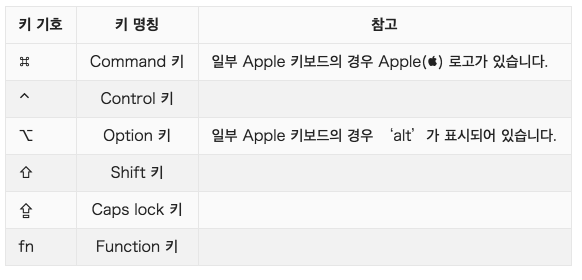
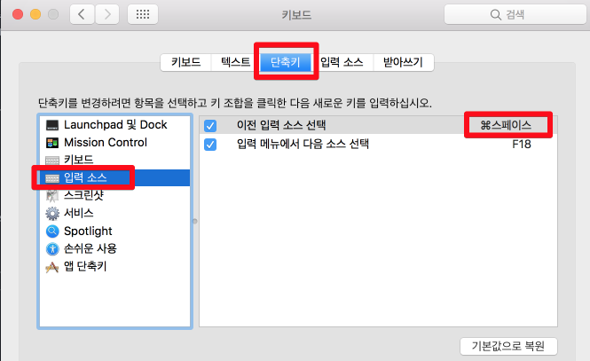

# 윈도우에서 맥북으로 넘어오기
이직한 회사에서는 맥북을 사용하게 되었는데, 윈도우에서 맥북으로 넘어오면서 특수키부터 시작해서 단축키까지 너무 달라서 적응하기가 힘들었다. 
그래서 나같은 개발자가 또 있겠지 싶은 마음에 하나하나씩 정리할 예정이다.

### 단축키
맥은 특수키들이 외우기가 어려웠다. 이를 쉽게 외우는 [링크](http://macnews.tistory.com/564)를 참고하자.  

* 화면 넘기기 : Control + 좌우 방향키
* 화면 전체로 보기 : Control + 위 방향키
* 뒤로가기/잘라내기/복사/붙여넣기 : Command + z/x/c/v
* 작업취소 : Control + c
* 현재 열린 윈도우 새로 열기 : Command + n
* 파일 삭제 : Command + delete

* [Alfred](http://macworld.hjsong.net/62) 실행 : Option + Space
* [Monosnap](http://macnews.tistory.com/1064)
  - 기본 캡쳐 기능은 **캡쳐 후 바로 편집이 힘들다**. Monosnap 사용을 추천한다.
  - **영역지정** 캡쳐 : Option + Command + 5
  - **전체영역** 캡쳐 : Option + Command + 6
* [iterm2](https://gist.github.com/helger/3070258)
  - 탭 이동 : Command + 좌우 방향키
  - 윈도우 세로 분할 : Command + shift + d
  - 윈도우 가로 분할 : Command + d
  - 윈도우 이동 : Command + Option + 방향키
* [Spectacle](http://macnews.tistory.com/3198)
  - 윈도우 화면 분할 : Option + Command + 방향키
  - 윈도우 풀 스크린 : Option + Command + f      

### IntelliJ 단축키
IntelliJ의 경우 검색하면 다 나오는거지만 그때 그때 찾는 것도 귀찮고, 빨리 외우고 싶어서 작성한다.  
Keymap 버전은 Default (Mac OSX 10.5+) 이다.  
(여담이지만 Atom의 경우 플러그인으로 intelliJ용 Kaymap을 제공하고 있어 해당 플러그인 설치시에 아래 단축키들을 Atom에서도 그대로 사용 가능하다.)  

* 전체 검색 : shift + shift
* Action 검색 : Command + shift + a
* 파일 저장 : Command + s
* 라인 삭제 : Control + delete
* 자동 완성 : Control + Space
* 라인 자동 정렬 : Control + Option + i
* 라인 추가 : Shift + return (enter)
* 라인 복사 : Command + d
* 라인 삭제 : Command + delete
* 라인 이동 : Option + shift + 위아래 방향키
* 선택 영역 좌우 이동 : Option + Shift + Command + 좌우 방향키
* 최근 파일 리스트보기 : Command + e
* 현재 Run 실행/디버깅 : Control + r / d

### 키보드 매핑 (Realforce)
타버전은 모르겠는데, Sierra 버전에서는 **Karabiner 설치시 기본 키보드 설정이 안먹힌다.**  
Realforce와 같은 윈도우 계열의 키보드 사용/미사용시 option키와 command키 변경을 자동으로 하기 위해 기본 키보드 설정만 사용하고, **그외 키보드 설정 어플리케이션은 사용하지 않는다.**  

(Realforce일 경우엔 option과 command를 변경)  

(IntelliJ에서의 자동완성키가 한영전환기본키가 겹치기 때문에 command+space로 변경한다.)  
 

**Ing....**
