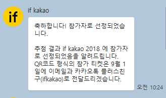
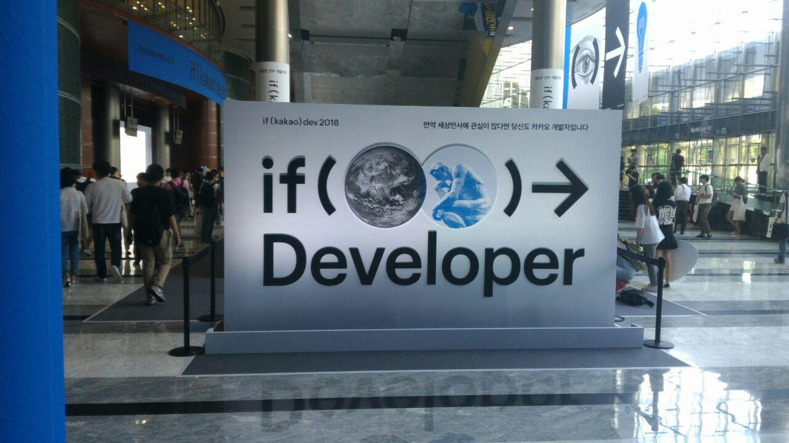
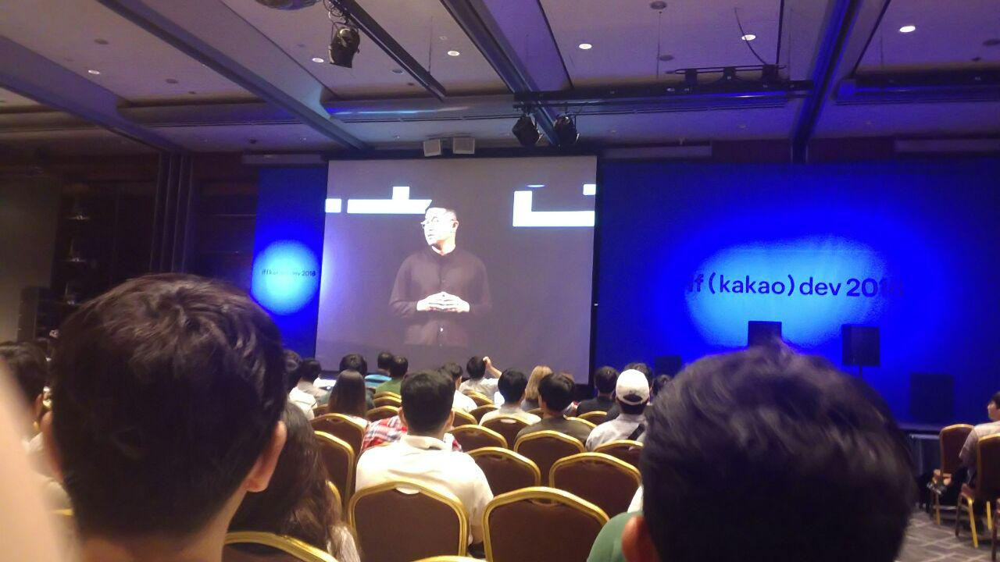
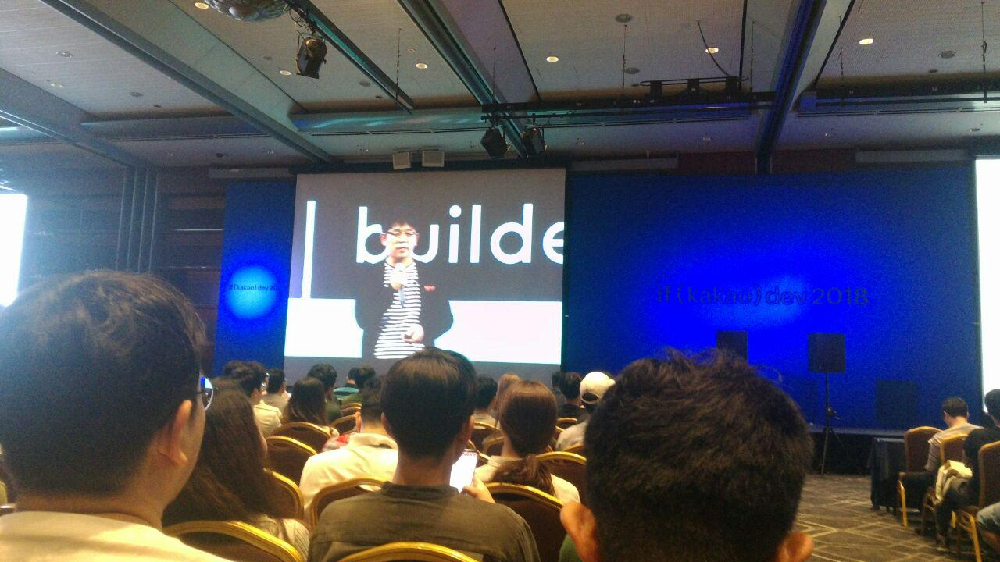

# 카카오 개발자 컨퍼런스 2018

카카오가 처음으로 진행한 개발자 컨퍼런스!  
[if kakao 2018](https://if.kakao.com/)에 다녀왔습니다!  
네이버에선 Deview라는 컨퍼런스가 없었고, 다음 시절에는 DevOn 이란 공식 컨퍼런스가 있었지만 카카오에선 공식 개발자 컨퍼런스가 없었습니다.  
언제 시작하시려나 했는데!  
드디어 개최되었습니다.  
이번에는 추첨으로 참석자를 뽑았는데요.  
제 주변 분들 중에선 저만 되어서 혼자 다녀왔습니다.



발표 장소인 코엑스 그랜드 볼룸이 왔더니 컨퍼런스에 왔음을 실감할 수 있었습니다.



자 그럼 키노트와 함께 후기를 시작하겠습니다.

## 0. 키노트



> 죄송하게도 제가 키노트 연사님의 성함을 멀리 있어 제대로 못들었네요 ㅠㅠ

키노트에선 카카오에서 기술적으로 바라보는 전반적인 관점을 소개

* 카카오가 바라보는 기술적 관점 4가지와 오늘 세션
    * 안정성
        * 카프카, 산전수전 노하우
        * 카카오 클라우드 네이티브 플랫폼
        * 카카오 광고 플랫폼 MSA 적용 사례
        * 글로벌 게임 플랫폼에서 무정지, 무점검 서버 개발과 운영 사례
    * 사용자 경험
        * 다음 첫 화면 개선기
        * 다음 웹툰 UI 개선기
        * 카카오뱅크의 앱 개발
    * 데이터
        * 카카오네비 최적 경로 분석
        * 카카오 AI의 음석 분석
    * Next Innovation
        * AI
        * 블록체인

### 0-1. 카카오 AI (Kakao i)



카카오 AI는 현재 어디까지 와있을까?

* 명령어 인식 실패울 
    * 현재는 5.9%까지 낮춤
* kakao i 오픈 빌더
    * 사용자의 서비스를 AI로 전환시켜주는 플랫폼
    * kakao i 오픈 빌더 + 카카오 미니 + 카카오톡 챗봇
* 사용자들은 어느 포인트에 가장 결제 하고 싶어할까?
    * 카카오는 자동차와 집이라고 생각
* 1번째 시도
    * 카카오 네비 + kakao i
    * 올해 내 출시 예정
    * 카카오 네비를 음성으로 길을 찾고, 노래를 듣고, 톡을 보내는 등을 지원
    * 현대 자동차 그룹과 연계하여 카카오 네비를 적용 중
        * 2019년내에 출시 예정
* 다음 단계로 집을 생각
    * 음성으로 집을 제어하는 방향
    * 한국의 환경은 대부분이 아파트에 거주
        * 아파트는 대부분이 빌트인이라 카카오 AI가 빌트인에 들어가야함
    * GS건설과 포스코 건설과 연계
        * 빌트인 된 것외에도 단독 주택, 여러 디바이스를 모두 통합하는 프로젝트 : 카카오 홈 
    * 포스코 평택 소사별 단지에서 작동하는 영상
    * 카카오 톡을 통해서도 제어할 수 있도록 출시
* 집과 자동차에 집중하면서 플랫폼 확장성, 안정성에 집중
    * 오픈 플랫폼화 결정
    * kakao i developers: 2018년 12월 내 베타 오픈 예정

### 0-2. 개발자 커뮤니티 + 카카오

카카오가 앞으로 개발자 커뮤니티에 대해서 어떻게 지원할지

* 컨퍼런스를 시작으로 커뮤니티와 함께 성장하는 것을 시작하고자 함
* 개발자들이 모이는 장을 만드는 것
    * 오늘과 같은 행사를 만들어 개발자들이 모이는 것에 좀 더 도움이 되고자 함
    * AI 컨퍼런스, 봇 경진대회, 딥러닝 캠프, 코드 페스티벌, 카카오 아레나 등등의 여러 행사 준비중
    * 카카오 블라인드 채용
        * 서류 전형 없이 코딩테스트와 면접만으로 채용
* 기술 개방을 통한 기여
    * Open API, Platform, Tech Product 공개
    * 개인 개발자, 스타트업들이 Tech Product를 통해 시간 단축을 예상
* tech.kakao.com
    * 카카오의 개발 블로그를 좀 더 활성화 예정
* 자원 공유를 통한 커뮤니티 지원
    * 개발자 컨퍼런스 및 학계 세미나 후원
    * 카카오 오피스에서 밋업 지원
    * AI분야 대학원생 장학 프로그램


키노트가 끝나고 이제 본격적인 세션 발표가 시작 되었습니다.  
저는 다음과 같은 주제들을 들었습니다.

1. AI 시대에 맞는 서비스 개발
2. 카카오 봇 플랫폼 소개
3. 카카오 광고 플랫폼 MSA 적용 사례 및 API Gateway와 인증 구현에 대한 소개
4. 모바일 게임플랫폼과 인프라 구축 경험기
5. 스프링5 웹플럭스와 테스트 전략

다른 발표는 아마 곧 발표자료가 올라올것 같습니다!

## 1. AI 시대에 맞는 서비스 개발 - 이석영

* kakao i, kakao mini를 이용한 서비스 개발
* AI 시대의 서비스 개발?
    * AI 시대라는 말은 굉장히 포괄적
    * AI 시대의 프로덕트는 영화나 애니에서 나오는 제품들을 생각하는 경향이 강함
        * 하지만 이는 아직 먼 미래이고 현재는 아님
        * 영화나 애니의 AI 제품은 3가지 특징이 있다.
            * Movable: 스스로 움직일수 있고 
            * NUI: 음성대화 인터페이스와 카메라로 상대를 인식 
            * Intelligence: Inteli사람보다 똑똑함 
* 실제 지금의 산업 구조는 이 3가지가 구분되서 제품이 출시되고 있음
    * Intelligence
        * 딥러닝, 텐서플로우, 알파고
    * NUI (네츄럴 유저 인터페이스)
        * NLU, ASR, VR, Alexa, Google Assistant
    * Movable
        * Sensor, Mechatronics, Boston Dynamics
* NUI
    * 주요 국내외 IT 기업들의 활발한 진출
    * AI 관련 기술의 복합적용
    * 높은 소비자 경험 제공
* **기존 서비스를 NUI에 맞춰 변화시키는 것은 AI 시대에 가장 효과적인 가치를 제공**하는 방법
* 과거로 부터 살펴보면
    * GUI
        * 메킨토시, 아이폰
        * 매킨토시가 나온지 30년이 지났지만 매킨토시의 인터페이스 체계에서 벗어나진 못함
        * 아이폰이 나온지 10년이 지났지만 터치 기반의 인터페이스 체계에서 벗어나진 못함
        * 다만 GUI 기반의 큰 단점 2가지
            * N Depth Touch
                * **수많은 기능들을 오직 터치를 통해 사용**해야하는 환경에서 오는 한계
            * 멀티테스킹 불가능
                * 터치 인터페이스 사용을 위해서는 **시선과 손을 모두 활용**해야함
    * VUI (음성 인터페이스)
        * 아마존 에코
            * GUI가 배제된 순수 음성 인터페이스 디바이스의 등장
        * Zero UI
            * 상시 전원에 연결되어 언제든지 별다른 준비 없이 즉시 명령 가능
            * 폰의 화면 잠금을 해제하고, 앰을 키고, 로그인을 하고 등등의 모든 과정이 생략
        * 음성으로 모든 서비스 이용
            * 음성 대화만으로 모든 서비스를 완벽하게 이용할 수 있게 제공
        * 북미 지역 가구 침투율 20%, 북미 4700만대 보급, 가장 빠른 성장세
        * 카카오 미니 6개월만에 20만대 보급, 주간 사용시간 5400만분, 일평균 80분
            * 코리아 클릭 뮤직앱 기준으로 3위 업체와 비슷한 시간
* **NUI는 일시적 유행이 아니라 사용자 경험 혁신의 큰 방향**이며, 이미 스마트 스피커등의 제품을 통해 실생활에 적지 않은 영향을 주고 있음
* 그럼 무엇을 어떻게 제공할 것인가?
    * 스마트폰에 익숙하다보니 **여러 단계를 거쳐서 원하는 행위를 하는것에 익숙**한 상황
    * VUI에 익숙하면 즉시 실행하는 방식에 적응하면 다시 GUI로 돌아가긴 힘들것
    * 즉, **빠른 실행**으로 음성을 통한 **경험 완결**이 가능한 **기능 단위의 서비스** 제공
* 현재 스마트 스피커의 주 사용 공간은 **집**
    * 카카오 미니 시간대별 사용패턴
        * 주중에는 출근 준비 시간이 압도적으로 많음
        * 이후에는 오디오 콘텐츠 소비
* 집 다음은 자동차
    * kakao i 자동차 공간으로 적용 확대 예정
    * 음성 서비스들 대부분이 자동차에 탑재될 예정
* 서비스를 구성하는 **핵심 기능을 직접 실행**하는 형태의 서비스 개발 필요
    * 머릿속에서 앱이란 단어를 지워야한다고 생각함
    * 사례: 카카오톡 음성으로 보내기
        * 실제 음성 플랫폼을 사용하다보니 음성이 들어오면 뒷단에서 손으로 앱을 하나씩 실행하는것과 같은 프로세스가 진행
        * 이건 앱 그대로 사용성과 다를바 없고, 뒷단에서 하나씩 프로세스가 처리되는게 아니라 즉시 기능 실행이 필요함
* 서비스를 NUI로 변경하는데 중요한 것은 핵심/본질적인 기능에 충실할것
    * 실제로 전체 사용율의 60 ~ 70%는 핵심 기능
* APP의 주용 기능 != 봇의 주요기능
    * APP에서 주요 기능은 재생 목록 관리
    * 카카오 미니에는 그런 기능이 없고, 굳이 왜 그런 기능이 필요한지 못느끼게됨
        * 노래를 듣는다는건 즉시 감성에 의해 사용될때가 많음
        * 김광석 노래 틀어줘, 멜론 탑100틀어줘 등등
* **APP과 NUI는 상호 공존이 필요함**
    * 모든 기능을 NUI가 제공하기는 힘듬
    * 서비스의 본직적 가치는 같지만, 사용자 경험은 다름
* 추천하는 방법
    * 일단 많이 써보는 것
    * 카카오 미니 노래를 써보기 전까지는 몰랐던것이 많음
* VUI에 적합한 형태로 개발된 기능은 집과 조당차 환경을 통해 확산될 것이며, 서비스의 본질적 가치를 담은 핵심 기능들이 중심이 될것
* 카카오 i 플러그인 서비스
    * 카카오 미니용 NUI 서비스 제공 플랫폼

### Q. NUI에서 피드백이 약한데 이걸 어떻게 해결할지

* 지금은 완벽하게 피드백 주기가 힘듬
* 조금 긴 텍스트까지 듣는데는 문제 없음
* 실제로 손을 쓸수없는 상황에서 불편하다 정도는 아닌것 같음
* 음성 메세지를 다시 한번 읽어주면서 오류가 없음을 재확인 받는 방향으로 모든 회사가 가고 있음
* 아직 고민이 만이 필요한 영역인것 같음

### Q. 화자 판단이 중요한데 어떻게 할지 (아빠와 애기들 구별)

* 카카오톡 읽기 같은 프라이버시 기능이 많기 때문에 중요하게 생각 하고 있음
* 얼굴, 홍채 등은 오랜 시간 발전시켜온 기술이지만, 음성 인식은 인증까지는 그단계에 도착하지 못했다고 생각함
* 목소리가 비슷한 형제/자매를 구별하기는 힘듬
* 계속해서 발전시키고 있는 단계

### Q. 스마트 폰에서 카카오 I를 활용할 수 없을지?

* 아직 고민은 하고 있는 단계
* 소상공인 사업자들이 사용하시는 POS기 등에 대해 kakao i를 적용할 수 없을지 등등을 고민중

### Q. 카카오 미니가 추구하는 방향은 어떤건지?

* 사용자 경험의 변화를 이끌고자함
* 음성이라는 것도 어떻게 보면 중간단계라고 생각함
* 내가 움직이는 기척만으로도 카카오 미니가 동작센서로 인식하고 예약된 행동을 하는걸 궁극적으로 가고자 함
* 단지 UI의 변화만 노리고 있는 건 아님

## 2. 카카오 봇 플랫폼 소개 - 황지수

* 사람 대 사람, 컴퓨터 대 컴퓨터의 대화가 아닌 사람과 컴퓨터의 대화가 되도록 중간에서 변경해주는 것이 챗봇
* 봇 플랫폼 기능
    * 봇 빌더
    * NLP + ML
    * Deploy + Test
    * Integration
    * API
    * Analytics
* Entity
    * Data와 Engine으로 구분
        * Data
            * Sample
            * Params
            * Action
            * Output
        * Engine
            * 챗봇 처리 로직 코드
    * Entity는 **특정 패턴에서 변경되는 부분**으로 파라미터로 사용될 수 있는 영역
        * 내일 판교 날씨 어때?, 주말 강원도 날씨 어때?
        * 여기에서 "[@시간] [@도시] 날씨 어때?" 라는 패턴이 됨
        * Entity는 시간: 내일, 모레, 주말, 오후 등등, 도시: 판교, 서울, 강원도, 베이징 등등
    * [@시간] [@도시|@국가|@나만의 장소] 날시 어때?
        * 도시, 국가는 시스템에서 제공
        * 나만의 장소는 봇 설계자 생성
    * Entity를 파라미터로 변경
        * 판교라는 값이 넘어오면 위도/경도 값을 시스템에서 찾아서 전달
        * 만약 나만의 장소에서 우리집 이란 값이 넘어온다면 Custom Resolver로 값 치환
        * Custom Resolver를 제공하기 때문에 사용자별 원하는 치환 로직 가능
* Skill
    * 좀 더 Rich한 응답을 보내고 싶을때 사용
    * 파라미터에 따라 커스텀한 응답 결과 보내줌
        * 레이아웃
            * 카드, 이미지, 텍스트, 퀵 리플라이
        * 버튼
            * 카카오 TV, 지역, 바코드 스캔, 휴대폰 번호 등
* 챗봇을 만든다는 것은 Block (Pattern + Entity + Skill) 설계
* Block Classification
    * 기존 ARS 시스템을 통해 환전 금액을 확인한다고 하면 Root -> 외화 -> 환전 -> 달러 -> 환전금액 계산 이라는 몇뎁스의 로직을 태워야함
    * 챗봇의 경우 이런 Depth 탐색 없이 바로 실행 가능
    * "내일 판교 날씨 어때" 라는 메세지가 오면 Patern + ML Model로 Context를 결정해서 Block을 선택하는 방식
    * "내일 판교 날씨 어때" 라는 메세지를 한국어 형태소 분석을 통해 Entity Tag 생성
        * [@시간] [@도시] [Weather] [어떠하다]
        * 어떤가요도 어떠하다이기 때문에 가능
        * 날씨 외에 기상정보로 넘어와도 Entity Tag가 Weather로 할당되기 때문에 같은 결과 가능
* 대화 맥락
    * 판교 날씨 어때? -> 맑은 가능 날씨입니다 -> 서울은? -> 비슷해요
    * Context Matching
        * 판교 날씨 알려줘 : 날씨 조회 상태
        * 다음 턴에서 서울은? 이란 말은 날씨 조회에 맵핑 되도록 봇 빌더를 통해 설계 가능
        * 만약 오후 일정 알려줘? 의 경우 특정 태그에 할당시키지 않고 언제든 실행 가능한 Block으로 설정 가능
* Recap
    * Pattern, ML 기반 분류기
    * User Context를 고려한 Block 선택
    * 카카오 뱅크 고객센터에 적용후 상담원 문의량 50% 감소
* Integration
    * 멜론, 카카오 배달 등과 연동해서 사용중
    * 카카오 계정을 기반으로 연동
* 카카오 봇 플랫폼은?
    * 쉽게 챗봇을 개발할 수 있는 도구
    * 챗봇을 똑똑하게 만드는 AI기술
    * 카카오 서비스와 유기적 연결

### Q. 외국어에 대한 자연어 처리는 어떻게?

* 서비스 영역을 확대한다면 고민이 필요할것 같다
* 지금은 한국어 위주로 처리

### Q. 모바일 페이지를 챗봇 전환으로 하고 싶은데 한계가 있는것 같은데 커스텀 레이아웃 지원에 대한 계획이 있는지

* 웹 기반 서비스에 비해 챗봇은 한계가 있다고 생각함
* 이런 부분에 대한 니즈는 충분히 느끼고 있음
* 웹뷰를 그냥 넣는게 과연 좋을까에 대해선 의견차이가 있다고 생각함
* 챗봇을 사용하는데 인터럽트 발생이 옳다고는 생각하지 않음

### Q. 카카오 봇 빌더가 한국에서의 차별점은? 빌더를 다른 메신저로 확장도 생각하고 계시는지

* 검색을 한다는건 자연어 처리와 데이터가 있어야하는데 카카오는 계속해서 이를 발전시켜놓은 상태
* 현재는 카카오톡 외에는 계획이 없음

## 3. 카카오 광고 플랫폼 MSA 적용 사례 및 API Gateway와 인증 구현에 대한 소개

* 카카오 광고 플랫폼
    * 카카오 이용자가 있는 어느 서비스든 광고 노출
    * 광고 등록부터 광고 성과 분석까지 가능한 원스톱 서비스
    * 광고 목적 최적화 지원
    * 오디언스 타게팅을 지원
* 디지털 광고 시스템
    * DSP : 광고주를 위한 서비스
    * SSP : 광고 퍼블리셔를 위한 서비스
* DSP
    * 광고주를 위한 서비스
    * 광고 등록 및 정산 보고서
    * 대행사를 위한 서비스
    * 광고게정 영업권 관리
    * 광고 플랫폼 관리
* API Gateway
    * API Routing
    * 인증/인가
    * 이용 제한
    * Aggregation
    * Logging
    * 분석
    * 중계
* 많은 소프트웨어가 있지만 **Netflix Zuul**을 선택
    * Spring과 잘 연동되고 있음
    * 간단하고
    * Netflix가 실제로 사용중이라는 점에 선택
* Netflix OSS
    * Eureka
        * Service Discovery
    * Ribbon
        * 로드밸런싱
    * Zuul
    * Hystrix
        * 서킷브레이커
* 그렇다면 카카오 광고 DSP 구성은?
    * 처음
        * Zuul -> L7 -> 각 DSP 모듈 서버
    * 장애가 발생
        * Elastic Search OOM이 발생했고 당시 RestTemplate은 디폴트 request Time으로 무제한 커넥션 대기 -> 한개의 모듈이 커넥션을 계속 물고 있어 전체 서비스에 장애 발생
    * Zuul -> Hystrix -> Rebbon -> 각 DSP 모듈 서버
* 하지만 또 장애
    * Ribbon은 디폴트가 라운드 로빈 방식
    * 서버 상태를 체크 하지 않음
    * 옵션 변경으로 죽은 서버는 목록에저 제외하도록 변경
* 오픈 API 사용 제한은 어떻게 하지?
    * Zuul1은 Servlet 2.5, Websocket not support라서 선택하지 못함
    * Zuul2는 Limit Rate지원
    * Spring Cloud Gateway가 출시되어 최종 선택
        * Spring Cloud Gateway FilterFactory
            * 필터를 통해 HTTP 요청이나 응답 데이터를 필터링 하여 수정가능

### 인증과 인가

* 마이크로 서비스 인증 및 권한 부여 방법
    * 고정세션관리
        * 특정 사용자의 모든 요청이 동일한서버로 전송
    * 세션복제
        * 각 인스턴스가 모든 세션 데이터를 저장하고 네트워크를 통해 동기화
    * 중앙 집중식 세션
        * 공유 세션 저장소에서 사용자 데이터를 엑세스
        * 가용성과 확장성이 좋은 편
        * 세션 저장소에 대한 보호메커니즘이 필요
    * 클라이언트 토큰
        * 인증 정보를 사용자 브라우저에 저장
        * 보통 쿠키 사용
        * 위 변조가 불가하도록 암호화 필요
    * SSO
        * 한번 로그인하면 여러 서비스에 로그인 공유
    * API 게이트웨이를 통한 클라이언트 토큰
        * 게이트웨이에서 인증정보 관리
* 카카오 광고 플랫폼 인증
    * 로그인 -> 카카오 계정에서 쿠키 발급 -> 광고 플랫폼 로그인 시도 -> 게이트웨이에서 JWT발급 -> 이후 Request는 JWT 토큰으로 인증
* JWT
    * 문자열로 구성
    * .을 기준으로 3단위로 구분
    * Header, Payload, Signature
        * 마지막 Signature를 통해 Payload가 위변조 되었는지 확인
    * Restful 서비스에 적합
        * **쿠키 방식의 경우 쿠키의 출저가 된 도메인에 대해서만 사용할 수 있다는 단점 해소**
    * 토큰 만료시간을 미리 알고 갱신 요청 가능
* Refresh Token
    * id
    * Service Type
    * IP정보
    * 생성시간
    * 만료시간
* Access Token
    * id
    * 사용자정보
    * 광고 계정 ID
    * 권한 정보
    * 생성시간
    * 만료시간
* 일반적으로는 별도 인증서버를 통해 권한을 획득하고, 리소스 서버를 통해 권한 관리
* 로그아웃 문제
    * JWT 특성상 자체 만료시간이 기술되어 있으므로 강제 무효화가 안됨
    * JWT관리 및 opaque token 고려중
    * **유저에게 opaque token 발급 -> API Gateway 에서 JWT로 변환** -> 인증정보 확인
    * 로그아웃 발생시 **API Gateway가 opaque token 폐기**하면서 로그아웃 처리

## 4. 모바일 게임 플랫폼과 인프라 구축 경험기 - 최양민, 이강인

발표는 동남아 지역에 신규 게임을 소프트 런칭하는 과정

> 신기하게 이 발표는 2분이서 나눠 발표를 진행하셨습니다.

### 4-1. 게임 서비스 인프라를 어떻게 할까? - 최양민

* 카카오 모바일 게임 서비스 인프라는 AWS 클라우드 사용중
* 서비스 대상 지역의 네트워크 품질은..?
    * 글로벌 서비스 인프라 위치를 어디로 잡으면 될까?
    * 동남아의 현지 네트워크 품질 파악이 필요했음
    * 네트워크를 상시 체크하면 좋겠다는 생각에 지표 생성
        * 한국을 기준으로 전세계 네트워크 Latency 측정
        * 동남아 전역에서 한국까지 네트워크 Latency 120ms ~ 350ms
        * 동남아 전역에서 싱가폴까지 네트워크 Latency 20ms ~ 150ms 정도
* 클라우드 vs IDC?
    * 시뮬레이션 결과 - IDC의 경우 초기 투자비용이 높게 발생하지만 9개월이 지나면 훨씬 더 저렴
    * 하지만 동남아에 소프트 출시할 예정이였고, **모바일 게임 특성상 3개월이면 계속 갈지 말지 결정**되기 때문에 IDC를 선택하기엔 리스크가 있었음
    * 서비스 추이를 보고 장/단기 계획을 잡음
        * 초기 런칭은 클라우드
        * 3 ~ 10개월쯤 IDC로 전환 준비
* 게임 서버는 싱가폴, 게임 플랫폼은 한국에 둬야함
    * 인도네시아 -> 서울로 접속해야하는데 어떻게 해야하지?
    * 게임 플랫폼 앞에 가속 솔루션을 두자!
        * 아카마이 등

### 4-2. 게임 플랫폼 구축기 - 이강인

* 20개정도 되는 서버가 있고 API Gateway를 통해서 나가고 있음
* https, wss로 제공중
* **API Gateway앞에 가속 솔루션**을 두었음
    * GSLB도 같이 사용
        * DNS 서버
* 가속 솔루션의 핵심 원리는?
    * 보통 최초 연결시에 통신 많이 느림
        * TCP Handshake with TLS를 진행할때
        * 클라이언트가 가까우면 빨라진다.
    * 최초 연결이 느리니 "서버를 가까이 두자"가 가속 솔루션의 핵심 원리
* 우리가 만들어보면 어떨까?
    * 기능 구현은 쉬운데, 보안관리 난해, 개발할 내용이 너무 많음
    * 라고 포기했는데 팀원이 재시도
* 팀원이 제안을 Api Gateway를 중간 (싱가폴)에 두고 직접 만든 가속 솔루션을 서울에 두고 각서버들의 앞에 두는 걸로 변경
    * 가속 솔루션과 비교: latency 차이 없음
    * 장점: end to end 모니터링가능, 비용 저렴
    * 단점: 서버 관리 이슈 증가
* 처음에는 파급 업무가 클거라고 생각못함
    * 모니터링 재구축
    * 서버 배포 재구축
    * 오토 스케일링 재구축
    * 생각지 못했던 다양한 이슈들
* 모니터링
    * 머신, JVM 메트릭 -> cloud watch
    * api 메트릭 -> hystrix
    * server logs -> ELK
    * 위 3개를 모아서 모니터링 분석기에 연동해서 알람을 발송
        * 너무 많은 알람을 받아야해서 재구성이 필요

### 4-3. 서비스 개시. 운영시작. 헬게이트 오픈 - 이강인

* 기존 배포 프로세스
    * github -> build -> svn -> deploy
        * SVN은 롤백 쉽게 하려고 사용
    * latency가 커지는 상황에서 불안정
        * 싱가폴 <-> 서울 SVN 통신이 불안정
    * 개선
        * github -> build -> s3 -> deploy
        * 롤백을 위한 bucket 관리
* 마케팅을 대비하기 위한 오토 스케일링
    * 동접, 시간등 확실한게 없던 상황
        * 사실 게임업계에서는 비일비재한 상황
    * 오토 스케일링 적용하는건 자료가 많으니 패스
* DNS policy 적용 실패
    * 말레이시아에서 싱가폴로 접속하지 않고 일본으로 접속하는 상황
        * 원인
            * 와이파이 환경에서 구글 DNS 등의 Global dns 사용한 경우
        * 해결
            * 해당 케이스에 대해서 클라이언트에서 IP를 이용한 위치 파악 후 선택된 접속 주소 사용
* 국가별 법령 대응
    * USIM
    * OS 설정 등으로 대응
* Country 인식 오류
    * 원인
        * 블루스택 사용자의 경우 발생
    * 해결
        * 해당 케이스 국가 코드 특별 처리
* 타임존에 대한 고민
    * 결제했는데 결제 로그가 안보여요
    * 원인
        * 잘못된 time zone 사용
    * 해결
        * epoch time format 제공
* API Gateway <-> 자체 구축한 가속 솔루션 사이 메세지 유실
    * 카프카, kinesis연동을 통한 중요 이벤트 저장 관리
* SDK 를 통한 File Upload가 네트워크 때문인지 잘 안되요
    * 가까운 위치의 S3 사용하도록 변경
* Edge 존의 철수
    * 동남아 전용 게임 서버와 한국에서 운영되는 게임 서버의 통합 서비스 운영
    * 해외에서만 단독 운영되던 게임 서비스 운영 종료
    * 서울 환경으로 안정적으로 이전하기 위해 Zone To Zone을 위해 실시간 Sync 환경 구축
        * AWS Kinesis 를 통해 실시간 Write 명령을 복사

### Q. 글로벌 시장에서 카카오 게임즈의 강점은?

* 프렌즈 IP의 힘이 큼
* KPOP을 통해 카카오톡을 쓰시는 분들 + 교민분들 등을 통해 들어오는 트래픽이 상당함
* 카카오 게임즈는 글로벌로 진출할때 페이스북, 텐센트와도 연계하기 때문에 카카오톡에 머물지는 않고 있음

### Q. 클라이언트 페치 데이터는 어떻게 배포하는지?

* 리소스 패치의 경우는 CDN 사용

### Q. 발표하신대로 개편하는데 사용된 인원은?

* 인프라실: 2명
    * AWS를 사용하고 있어서 인프라를 실제로 운영하는데 있어 실질적 구축은 1명이 다함
* 서버개발실: 3명

### Q. 아카마이 가속 솔루션 가격이 비싼걸로 아는데 가속 솔루션 사용을 API별로 분리해서 쓰시는지?

* API 별로 분리하진 않고 서비스 단위로 분리
* 이 서비스는 아카마이를 쓰자, 이 서비스는 쓰지말자 등등

## 5. 스프링5 웹플럭스와 테스트 전략 - 이일민 (토비)

* 발표 대상
    * Java8 +
    * Spring 5.x
    * 스프링 웹플럭스에 대한 경험 또는 지식이 있는 개발자
* 내용
    * 스프링 웹플럭스?
    * 플럭스와 테스트
    * 원격 리엑티브 API 호출 체스트
  
### 5-1. 스프링 웹플럭스

* 스프링 5.0에 새로 등장한 웹 프레임워크 + 리액티브 스택
    * 스프링 MVC 이후 15년만에 처음
    * 스프링 MVC와 두 개의 웹 기술 스택
    * 초기 이름은 스프링 웹 리액티브 였으나 플럭스로 변경
* 서블릿은 공통인가 아닌가?
    * 서블릿은 MVC와 플럭스 양쪽에 다 존재
* JPA/JDBC는 어디로?
    * **플럭스에는 JPA, JDBC가 존재하지 않는다**
    * Reactive Repositories가 존재
* Reactor 라이브러리는 양쪽에 존재
* 기본적인 HTTP API, Stream은 MVC와 플럭스는 차이가 없음
    * 웹플럭스의 ```@Controller```코드는 스프링 MVC의 코드와 크게 차이가 없음
* 웹플러스는 어디에? 왜?
    * 100% 논블로킹 개발이 필요할때
    * 확장성과 고효율성이 매우 중요
    * 업/다운 스트리밍과 백프레셔가 필요
    * 고속 서비스 오케스트레이션 개발
    * 유사한 프로그래밍 모델의 경험
        * NodeJS 등 사용해보신 분
    * 유연하게 커스터마이징이 가능한 웸 프레임워크 구성
    * 본격적인 함수형 프로그래밍 모델 사용
* 웹플럭스를 사용하지 말아야할 이유
    * 웹 플럭스가 왜 필요한지 분명하게 모름
        * 비동기/논블록킹 방식 도입하고 싶어서
        * 리액티브 라이브러리 사용하고 싶어서
    * 블로킹이 서버, 코드, 라이브러리에 존재
        * JPA, JDBC 등이 존재
            * **DB에 데이터 가져오는 동안 블로킹** 되버림
        * 블로킹 IO, 블로킹 서블릿 필터
    * Spring MVC로 개발했더니 아무 문제 없음
* 웹플럭스는 Spring MVC로 시작해도 됨
    * Spring5 MVC는 웹 플럭스에서 제공되는 다양한 기능과 프로그래밍 모델 제공
        * 개인적인 생각으론 70%는 커버한다고 봄
        * Spring MVC에서 WebClient 사용이 가장 좋은 출발점

### 5-2. 플럭스

리액티브 프로그래밍과 비동기/논블로킹

* 리액티브 프로그래밍
    * 인터넷 시대의 복잡함을 해결하기 위해
    * 연속적으로 일어나는 이벤트를 다루는 프로그래밍 기법
    * 서버 자원을 낭비하지말고 아낌없이 써버리자
* 비동기/논블로킹 API 호출 - 가장 단순한 리액티브
    * 동기 블로킹 API 호출 - RestTemplate
        * 쉽고 간단함
        * IO동안 블로킹
    * 비동기/논블로킹 API 호출
        * AsyncRestTemplate (Spring 4)
        * Async/Await (Java 8+)
        * WebClient (Spring 5)
* 비동기/논블로킹 API 호출 - CompleteableFuture
    * 다른 언어의 Promise와 비슷함
    * 예외처리를 단일화 가능
* Async/Await
    * 빌드타임, 로딩타임, 런타임 코드 생성
    * 비동기로 돌아가는 코드를 동기방식의 코드로 사용 가능함
    * Java 8+
* Reactor Flux/Mono
    * CompleteableFuture와 유사한 형태
    * WebClient 사용
    * Mono: 0~1 데이터 가져옴
    * Flux: 0~n 데이터 가져옴
        * Stream 

### 5-3. 플럭스와 테스트

* Mono/Flux 리턴하는 API를 어떻게 테스트할까?
    * 단위테스트/통합테스트 둘다
* 주의 사항
    * 테스트 코드는 항상 "동기방식"으로 작성
    * 하지만 테스트 대상은 비동기/논블로킹 방식
* ```subscribe() + assert```
    * 제일 먼저 찾게 되는 방법
    * 테스트를 실행만 했기 때문에 subscribe안의 람다는 실행이 되지 않고 종료 되버리니 항상 성공해버림
    * 이를 해결하기 위해 ```countDownLatch```를 사용할 수 있음
        * 테스트가 끝날때까지 waiting
        * 하지만 에러로 countDown이 수행안되면 영원히 끝나지 않는 테스트가 될 수 있음
* ```block()+assert```
    * ```mono.block()```로 응답이 올때까지 대기 가능
    * 데이터가 하나 받을때만 쉽지만 복잡할때는 어려움
    * 전혀 리액티브한 방법이 아님
* ```StepVerifier```
    * 비동기 논블로킹으로 동작하는 코드 테스트 툴
    * 데이터 스트림의 검증
    * 예외, 완료도 검증
    * 가상시간을 이용해 오랜 시간의 이벤트 테스트
        * 하루치 데이터를 다 받은뒤 이 데이터를 검증하고 싶다고 해보자
        * 이 API가 하루 종일 돌았다는걸 설정할 수도 있음
    * ```StepVerifier.create(mono).expectNext(1).verifyComplete();```
    * ```expectNext()```는 연속해서 사용 가능해서 Flux와 같은 Stream의 데이터를 하나씩 뽑아서 검증 가능

### 5-4. 원격 리액티브 API 테스트

* WebClient를 적용함으로써 비동기/논블로킹 코드 사용을 시작해볼것
    * ```switchIfEmpty()``` == ```Optionl.orElseGet```
* 원격 리액티브 API까지 호출되는 WebClient를 테스트해야한다면?
    * ```StepVerifier```를 사용하는건 동일하지만
    * 외부 원격 서버를 실행해야만 하는데 불편함
    * 로컬 Mock 서버를 사용해보자
* ```okhttp3:mockwebserver```를 사용하길 권장
    * mockWebServer가 무슨 데이터를 받았는지도 쉽게 검증 가능
* 다만 Flux/Mono를 사용하는 코드는 인터페이스로 추상화를 시켜 테스트 코드 작성이 쉽도록 하는 것을 권장

### 5-5. 웹 플럭스로 서비스 구성

* 웹플럭스의 새로운 아키텍처
    * 기존 MVC는 서블릿 스펙과 서버의 제약위에 개발
    * 서블릿 컨테이너를 사용할 수 있으나 의존적이지 않음
    * Netty, Undertow 등 지원
    * 뛰어난 테스트 편의성!
* Functional Endpoint
    * 스프링 없이 순수한 함수형 코드로 서비스 개발 가능

### 5-6. 웹 플럭스 API 서비스 테스트

* ```TestWebClient```
    * WebClient와 비슷함
    * MockServer 자동 실행 지원
    * ```@WebFluxTest```를 테스트 클래스 위에 선언하면 사용 가능
    * ```bindToServer()```를 통해서 실제 동작하는 서버에 연결해서 테스트 가능
    * ```bindToController()```
        * WebHttpHandlerBuilder가 이용할 수 있는 WebHandler API구성을 가진 ApplicationContext를 이용
        * 특정 컨트롤러 핸들러만으로 테스트 가능하도록 지원
    * ```bindToRouterFunction```
        * 함수형 엔드포인트에 대한 테스트
        * 얘는 Mock서버 띄우고 사용하진 않음
        * 몇개의 코드로 사용 가능
* 함수형 엔드 포인트 테스트 방법
    * ```bindToRouterFunction```
    * ```@WebFluxTest```

### Q. Swagger가 웹 플럭스에서는 사용할수 없던데, 혹시 문서 자동화를 어떻게 하시는지?

* API 문서 자동화를 사용하지 않은지 오래됨
* 문서 자동화 기술이 따라가는 속도가 느려서 수동으로 작업하고 있음

### Q. Spring 5 관련 자료들은 어디서 찾으시는지

* Spring 공식 문서와 유튜브에서 보고 있음
* 이걸론 부족해서 Spring 프로젝트에 있는 테스트 코드를 많이 참고함
* 특히 통합 테스트 관련해서 잘 되어 있음
* **제가 최대한 책을 빨리 쓰겠습니다.**